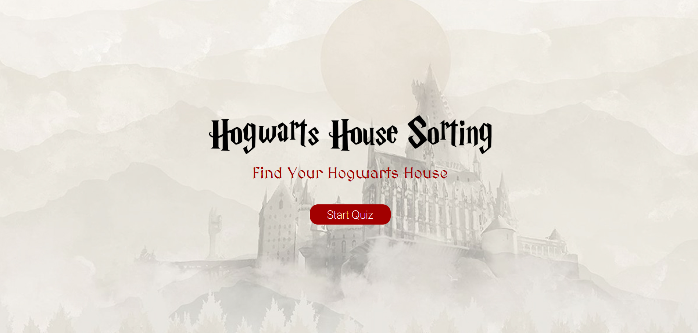
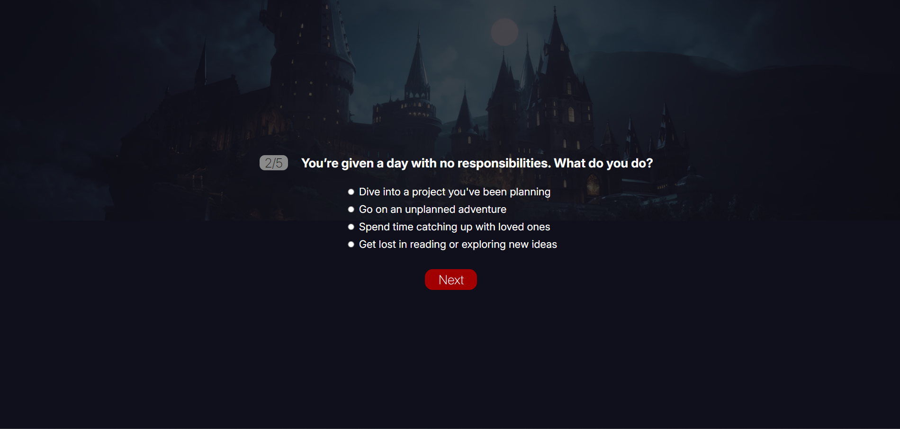
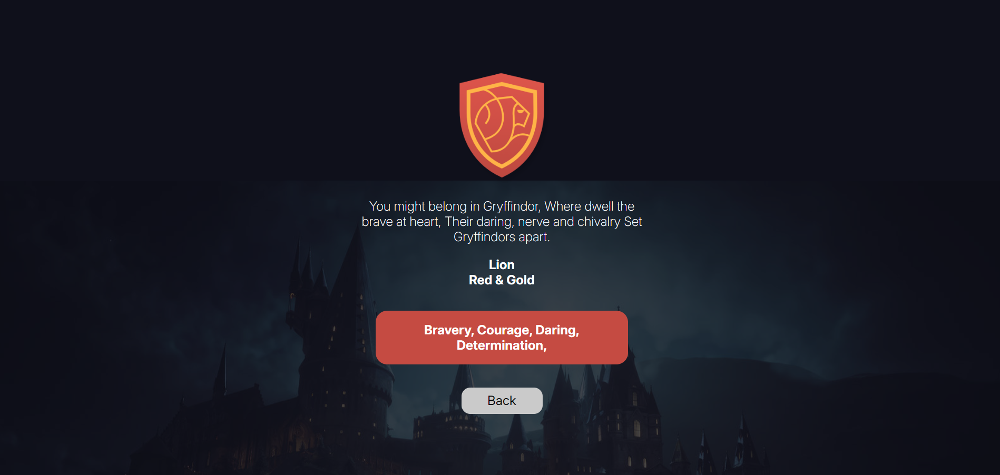

# 🧙 Which Hogwarts House Are You In?

A fun little Harry Potter quiz made with Python, Flask, and HTML/CSS.  
Answer 5 magical questions and find out which house you truly belong to! 🦁 🐍 🦅 🦡

---

### 📸 Preview






---

### 🚀 Features

- 5-question personality quiz
- Dynamic result based on your choices
- Clean UI with custom styling
- Responsive design
- Individual result page for each house

---

### 🛠 Tech Stack

- Python + Flask
- HTML / CSS (with custom fonts)
- Jinja2 templating
- Session handling for user progress

---

### ▶️ Run it locally

1. Clone the repo:

```bash
git clone https://github.com/hesoom/Hogwarts-house-sorting.git
cd hogwarts-quiz
```
2. Create a virtual environment and install requirements:
```bash
python -m venv venv
source venv/bin/activate  # On Windows use `venv\Scripts\activate`
pip install -r requirements.txt
```
3. Run the app:
```basg
python app.py
```
Open your browser and go to `http://localhost:5000`

---

### 🧹 To-Do

- Add more questions
- Save results with a database
- Add sound effects or animations
